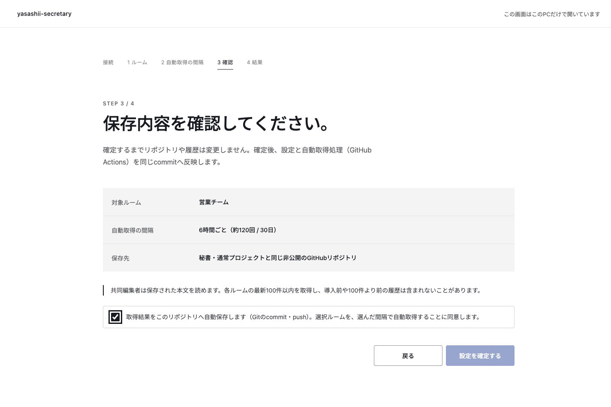

# yasashii-secretary — 非エンジニア向けAI秘書

**非エンジニア向けのAI秘書プラグイン**（Claude Code plugin / public / MIT）。
外部データ（メール・予定・ファイル）は各サービスに置いたまま公式コネクタで都度参照し、
記憶・成果物・営業やマーケティング等の一般プロジェクトを1つの非公開のGitHubリポジトリに置き、選択したChatworkルームの履歴も同じリポジトリで管理します。

---

## まず使ってみる（一般の非エンジニア向け）

### これは何？

あなた専属のAI秘書です。次のことができます。

- 決めたこと・好みを**覚えて守る**（うっかり消さない・前回の続きから再開できる）。
- 予定とTODOを突き合わせて**今日やること**を根拠つきで返す。
- 日次journal原本から**今週を振り返り**、古い月も確認してから安全に退避できる。
- 一度で終わらない仕事を、確認後に**プロジェクトとして整理**し、別の日も現在の状況から再開できる。
- Gmail・カレンダー・Outlook・Notion などに**公式コネクタでつなぐ**（設定画面のボタン操作だけ）。
- 「〇〇を作って」で、別プラグイン `yasashii-harness` の計画→実装→検証へ接続する。
- 「更新ある？」で現在版・最新版・変更の影響を読み取り専用で確認し、明示了承後だけ保護commit・更新・検証へ進む。

考え方はシンプルです。**メールや予定は各サービスに置いたまま参照し、秘書・一般プロジェクト・選択したChatwork履歴は1つの非公開のGitHubリポジトリで育てる**。
Chatworkの自動保存は、対象ルーム・自動取得の間隔・保存内容を確認して同意した後だけ有効になります。

### 入れ方（3コマンド）

Claude Code で、上から順に実行します。各コマンドの前に「今から何をするか」を書いています。

```text
# 1. このプラグインの配布元を登録する
/plugin marketplace add mtaiseeei/yasashii-secretary

# 2. yasashii-secretary プラグインを入れる
/plugin install yasashii-secretary@yasashii-secretary

# 3. 秘書を呼ぶ（初回はセットアップが始まります）
/secretary
```

### 初めての一歩

`/secretary` を初めて実行すると、**5問以内**（呼び方・主に使うサービス・任せたいこと・仕事や役割・説明の詳しさ）だけ聞かれます。
答えると、いまいるフォルダの中に**秘書ディレクトリ**（`secretary/`）ができ、秘書・一般プロジェクト・Chatwork設定をまとめる1つのprivate GitHub repoへ初回pushします。
口調は丁寧な標準設定で始まり、あとから「設定変えたい」で変更できます。
あとは「今日やること」「〇〇を覚えておいて」「Google につなぎたい」などと話しかけるだけです。

### Chatworkをつなぐ

`/chatwork` から、保存するルームと自動取得の間隔を画面で選べます。設定を確定するまでは、リポジトリや履歴を変更しません。



1. `/chatwork` を実行し、非公開のGitHubリポジトリと接続状態を確認します。
2. [ChatworkでAPI Tokenを取得する](https://www.chatwork.com/service/packages/chatwork/subpackages/api/token.php)か、[API Tokenの発行方法を見る](https://help.chatwork.com/hc/ja/articles/115000172402-API%E3%83%88%E3%83%BC%E3%82%AF%E3%83%B3%E3%82%92%E7%99%BA%E8%A1%8C%E3%81%99%E3%82%8B)へ進みます。Tokenページを使えない場合は、実際にAPIを使うアカウントで[組織契約のAPI利用申請を見る](https://help.chatwork.com/hc/ja/articles/115000169501-API%E3%81%AE%E5%88%A9%E7%94%A8%E7%94%B3%E8%AB%8B%E3%82%92%E6%89%BF%E8%AA%8D-%E5%8D%B4%E4%B8%8B%E3%81%99%E3%82%8B)から申請し、承認後に戻ります。
3. wizardが現在のGitHubリポジトリから作った「GitHub上の安全な保管場所を開く」を使い、自分で `CHATWORK_API_TOKEN` として登録します。API Tokenは有効期限がなくChatwork機能へフルアクセスできるため、第三者には見せません。Token値をwizardや会話へ貼る必要はありません。
4. 登録確認後だけルーム一覧を取得し、保存するルームを選びます。初回は各ルームの最新100件以内で、0件も正常です。
5. 30分ごと／1時間ごと（おすすめ）／3時間ごと／6時間ごと／12時間ごと／手動のみから自動取得の間隔を選びます。30日換算の概算実行回数は、約1,440回／720回／240回／120回／60回／0回です。
6. 対象ルーム・自動取得の間隔・保存内容を確認します。自動取得を選ぶ場合は「取得結果をこのリポジトリへ自動保存します（Gitのcommit・push）」へ同意した後だけ自動実行を有効にします。

実行回数とGitHub Actionsの処理時間は別です。GitHub Freeの非公開リポジトリでは、2026年7月時点で月2,000分の処理時間が含まれますが、2,000回の実行枠ではありません。実使用量はプラン、runner、1回あたりの処理時間で変わります。[GitHub Actionsの料金と利用枠を見る](https://docs.github.com/en/billing/concepts/product-billing/github-actions)で最新情報を確認してください。

> 公式情報は2026年7月確認。サービス側の変更により手順・料金・利用枠が変わる可能性があります。

`/chatwork search` は最初にrepoをpullして保存済み履歴を探します。見つからないときは
「同期して再検索（推奨）／同期しない／対象ルームを見直す」から選び、承認した場合だけ手動で最新メッセージを取り込みます（同期）。
同期後も、導入前・最新100件より前・未選択ルーム等の可能性があるため、「Chatworkに存在しない」とは断定しません。

### できること（今できる機能）

| やりたいこと | 呼び方の例 | 担当スキル |
|---|---|---|
| 初回セットアップ | `/secretary`（初回） | onboarding |
| 用件のふりわけ（窓口） | `/secretary` | secretary |
| 覚える・守る・前回の続き | 「覚えて」「消して」「前回の続き」 | memory-care |
| 今日やること | 「今日やること」「予定」「TODO」 | daily |
| 継続する仕事をプロジェクトにまとめる | 「この案件をプロジェクトにして」「状況を更新して」 | projects |
| 自分に合わせる設定 | 「設定変えたい」「もっとフランクに」「呼び方を変えて」 | settings |
| 今週のふりかえり・古い月の整理 | 「今週を振り返って」「古い月を整理したい」 | weekly |
| Google 接続 | 「Google につなぎたい」 | setup-google |
| Microsoft 接続 | 「Microsoft につなぎたい」 | setup-microsoft |
| Notion 接続（任意） | 「Notion につなぎたい」 | setup-notion |
| Chatwork 接続・ルーム選択・履歴検索 | `/chatwork`「Chatworkで探して」 | chatwork |
| 接続の状態を診断 | 「繋がってる？」「診断して」 | connections |
| 開発の入口（作って） | 「〇〇を作って」「開発したい」 | build |
| 更新状況を確認 | 「更新ある？」「最新版にして」 | update |

### 更新を確認する

「更新ある？」と話しかけると、現在版・最新版・主な変更・設定やファイルへの影響を確認できます。
この診断はplugin、workspace、Git、Claude Code設定を変更しません。実際のplugin更新やworkspace移行は、現在の版では行いません。
変更内容の正本は [CHANGELOG](plugins/yasashii-secretary/CHANGELOG.md) です。

2026年7月時点では、第三者marketplaceの自動更新は既定で無効です。使う場合は利用者自身が
`/plugin` → `Marketplaces` → 対象marketplace → `Enable auto-update` を選びます。診断が設定を変更することはありません。
また、pluginが自動更新されても、workspaceへコピー済みのファイルは自動では置き換わりません。
[Claude Code公式のmarketplace説明](https://code.claude.com/docs/en/plugin-marketplaces)も参照してください。

### まだできないこと（今後）

- LINE等の未対応チャットは今後の検討対象です。Chatworkは、API TokenをGitHub上の安全な保管場所（Repository Secret）へ登録し、選択したルームだけを同じ非公開のGitHubリポジトリへ保存できます。
- Notion は**任意**です。使わない人は繋がなくても、他の機能は普通に使えます。

くわしい使い方は [`docs/guide/`](docs/guide/README.md)（公開向けの使い方ドキュメント）を見てください。

---

## 仕組みと設計（リポジトリを覗く技術者向け）

### 設計思想: 「外部データは都度参照、Chatworkだけ承認済み同期」

| レイヤー | 置き場 | アクセス |
|---|---|---|
| 外部データ（メール・予定・ファイル） | 各SaaSのまま | 公式リモートコネクタで都度参照（同期しない） |
| 秘書の記憶（決定・好み・進行中案件） | 非公開のGitHubリポジトリ内 `secretary/memory/` | 直接読み書き＋Git管理 |
| 成果物（文書の正本） | 非公開のGitHubリポジトリ内 `secretary/docs/` | 直接読み書き＋Git管理 |
| 一般プロジェクト | 非公開のGitHubリポジトリ内 `secretary/projects/` | 確認後にライト作成し、必要時だけフル運用へ整理 |
| 選択したChatworkルーム履歴 | 同じ非公開のGitHubリポジトリ内 `chatwork/` | Repository Secretを使うGitHub Actions |

- 外部データのローカル同期層（キャッシュ・全文コピー）は作りません。根拠は「サービス名＋リンク/ID＋日付」で引用します。
- Chatworkの自動実行によるcommit・pushは、対象ルーム・自動取得の間隔・保存内容への明示同意後だけです。検索時の手動同期も実行直前に確認します。
- 記憶の書き込み・削除は `secretary/` 配下に**封じ込め**（境界外・symlink 越えは拒否）、秘密情報らしきファイルは**コミットしない**設計です。

### 構成

```
yasashii-secretary/                         ← public / MIT
├── .claude-plugin/marketplace.json   ← 配布元（forkedFrom で元作者をクレジット）
├── plugins/yasashii-secretary/        ← プラグイン本体（薄いルーター＋機能スキル）
│   ├── skills/                       ← secretary(ルーター)/onboarding/memory-care/daily/projects/settings/weekly/chatwork/update/
│   │                                    setup-google/setup-microsoft/setup-notion/connections/build
│   ├── rules/plain-language.md       ← 言葉づかいルール（既定3行・明示設定・語彙方針の一元定義）
│   ├── templates/                    ← 秘書ディレクトリの雛形（`${CLAUDE_PLUGIN_ROOT}` 相対で参照）
│   └── scripts/                      ← 決定的シーム（成果物保存・TODO・封じ込めガード）
├── docs/guide/                       ← 公開向け使い方ドキュメント（この README の続き）
└── docs/（spec・DESIGN・sprints・progress・feedback）← 開発内部ドキュメント
```

- SKILL は薄いルーター＋段階ロード。起動時に全機能を読み込みません。
- 開発機能は別リポジトリ [mtaiseeei/yasashii-harness](https://github.com/mtaiseeei/yasashii-harness) が担当します。本体にはハーネスやagentsを同梱せず、`build` は導入確認と接続案内だけを行います。
- 設計方針の正本は [`docs/DESIGN.md`](docs/DESIGN.md)、実装可能仕様は [`docs/spec/`](docs/spec/)、開発ループの契約は [`docs/sprints/`](docs/sprints/) にあります（開発内部）。

### 開発（やさしいハーネス）

「〇〇を作って」と言うと、`build` スキルが `yasashii-harness` の有無を確認します。未導入なら次の3コマンドを案内し、導入済みなら**計画→実装→検証**のループ（Planner → Generator → Evaluator）に接続します。

```text
/plugin marketplace add mtaiseeei/yasashii-harness
/plugin install harness@yasashii-harness
/harness <作りたいもの>
```

このループは [mtaiseeei/agentic-harness](https://github.com/mtaiseeei/agentic-harness) を上流とする別プラグインです。
非エンジニアには「いま計画→実装→検証のどこにいるか」を見せながら進めます。裏側の契約（docs/spec・sprint・rubric）は
AI が理解しやすいよう技術的文脈のまま維持しています。

### ライセンスとクレジット

- ライセンス: **MIT**（[LICENSE](LICENSE)）。
- 元作者: **[Shin-sibainu/cc-company](https://github.com/Shin-sibainu/cc-company)（MIT）**。導線（3コマンドインストール・オンボーディング・記憶保護）の発想を継承しています。
  `marketplace.json` の `forkedFrom` にも明記しています。

---

## 参考

- 使い方（公開向け）: [`docs/guide/`](docs/guide/README.md)
- 設計方針: [`docs/DESIGN.md`](docs/DESIGN.md)
- 詳細仕様: [`docs/spec/`](docs/spec/)
